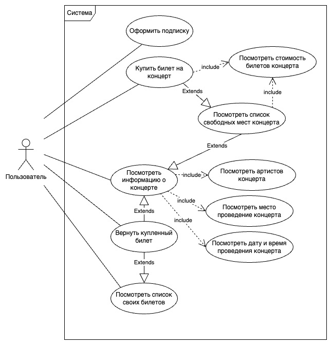

# Лабораторная работа №1. Формулирование требований к программной системе

### Чернов Никита, ПИ-21-3. Сайт продажи билетов на концерты

#### Стейкхолдеры

| #   | Стейкхолдер     | Описание                                                                                                                                           | Важные места                     |
| --- | --------------- | -------------------------------------------------------------------------------------------------------------------------------------------------- | -------------------------------- |
| 1   | Артисты         | Большую часть прибыли с концерта получают именно они. Также без них работы системы невозможна, так как билеты покупают именно на их выступления    | Выставление мероприятия          |
| 2   | Фанаты          | Основная прибыль с работы сервиса будет приходить именно из этой группы людей. Чем лучше сервис будет для них - тем больше купленных билетов будет | Покупка билетов, возврат билетов |
| 3   | Владельцы сайта | Первое время финансирование на разработку будут выделять именно эти люди. Основную прибыль с работы сайта получают они                             | Стабильность работы сайта        |

#### Функциональные требования

1. Разрешить одновременную покупку билетов несколькими пользователями
2. Не продавать место больше одного раза одно и то же место
3. Покупатели могут видеть обзор оставшихся мест
4. Покупатели могут оформить подписку с преференциями на покупку билетов и приоритетом оповещения
5. Покупатели могут сдать билет до начала концерта

#### Диаграмма использованя

#### Нефункциональные требования

##### Производительность

- Система должна выдерживать нагрузку до 12000 rps

##### Масштабируемость

- Система должна быть горизонтально масштабируема

##### Требования к переносимости и совместимости системы

- Уведомление пользователей с подпиской происходит путем сообщения на месссенджер, с которым у нас есть сотрудничество
- Система должна иметь возможность интегрироваться с другими онлайн системами по продаже билетов

#### Предположения

1. Система должна работать на 2 языках
2. Система должна сохранять историю покупок билетов
3. Покупка должна происходить через карты Mir Pay или через СБП.
4. Заносить заявку концерта должно ответсвенное лицо исполнителя
5. Заявки рассматривают и публикуют администраторы сайта
