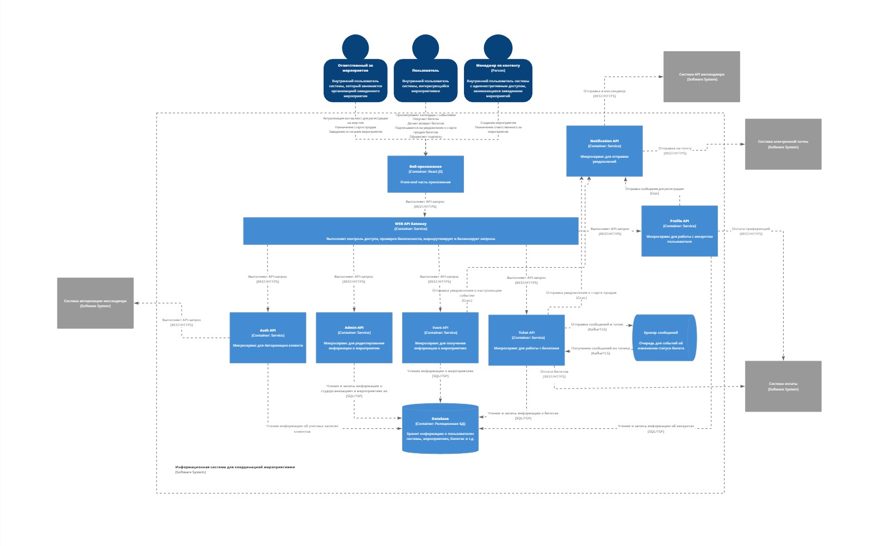
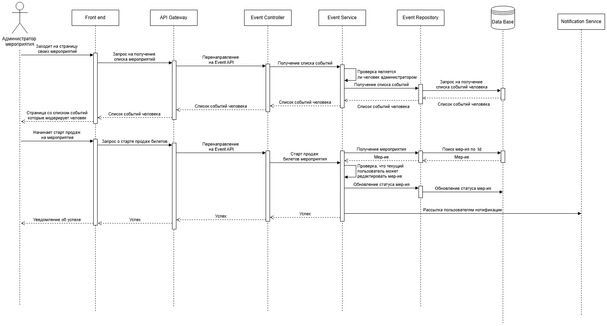
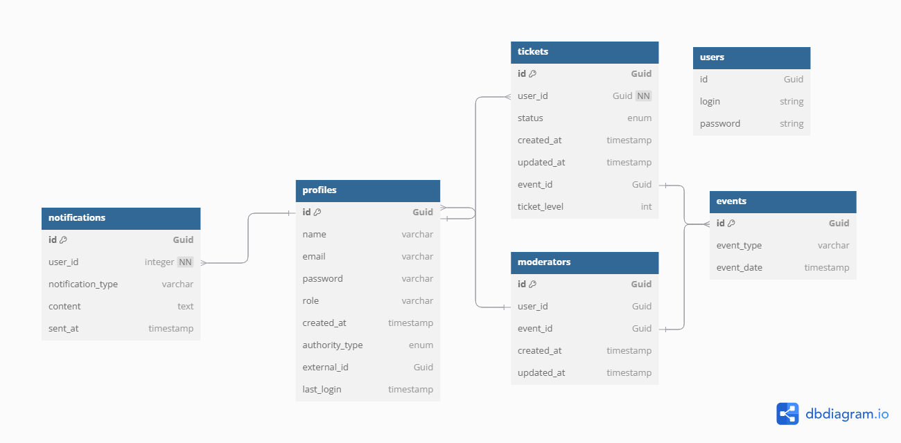

# Диаграмма контейнеров

Диграмма контейнеров системы представлена ниже. Более качественно можно посмотреть по [ссылке](https://miro.com/app/board/uXjVIZNJL5c=/?moveToWidget=3458764618709119085&cot=14)



# Диаграмма компонентов

Диграммы компонентов двух сервисов (Event Service и Ticket Service). Детальнее по [ссылке](https://miro.com/app/board/uXjVIZNJL5c=/?moveToWidget=3458764620563586480&cot=14)


# Диаграмма последовательностей

Для диаграммы послежовательности выбран кейс ручного старта продаж билетов на концер администратором.


# Диаграмма базы данных

Диаграмма базы данных представлена ниже. Хочется выделить сущность Profile, которая существует отдельно от User. Связано это с тема, что в приложение есть несколько точек входа, а именно через нашу систему авторизации и через стороннюю систему мессенджера.



# Применение основных принципов разработки

## KISS

Код должен быть простым и понятным. Мы избегаем излишней сложности.

Для применения данного принципа изменим код ниже

```cs
public IEnumerable<Event> GetActiveEvents()
{
    List<Event> activeEvents = new();
    var allEvents = await eventRepository.GetAll();
    foreach(Event event in allEvents)
    {
        if (event.IsActive)
        {
            activeEvents.Add(event);
        }
    }

    return activeEvents
}
```

Изменим цикл форич на linq запрос, это упростит сам запрос и поывсит его читабельность.

```cs
public IEnumerable<Event> GetActiveEvents()
{
    var allEvents = await eventRepository.GetAll();
    return allEvents.Where(event => event.IsActive)
}
```

## YAGNI

Не добавляем функциональность, которая пока не нужна.

В первоначальных требованиях к приложению не было функции отложенного бронирования билета без его оплаты. Поэтому не будем реализовывать данный функционал.

Фунционал ниже **не** нужно реализовывать

```cs
public async Task Book(Guid ticketId, DateTime timeTo)
{
    ...
}
```

## DRY

Избегаем дублирования кода, вынося общую логику в отдельные методы или классы.

Данный подход применяется в вынесе повторяющейся логики проверки продан ли билет в отдельный метод.

```cs
public async Task<bool> IsSold(Guid id)
{
    var ticket = await _ticketRepository.GetById(id);
    return ticket.Status == TicketStatus.OpenForSale;
}
```

Теперь мы можем не дублировать одну и ту же логику, а вызывать этот метод.

## SOLID

### Single Responsibility Principle (SRP)

Каждый класс должен иметь одну ответственность.

Интерфейс для работы с билетами отвечает лишь за работу с билетами. В нем нет методов для работы с мероприятиями, так как это не его зона ответсвенности.

```cs
public interface ITicketService
{
    Task<Ticket> GetById(Guid id);
    Task<Ticket[]> GetUserTickets(Guid userId);

    Task UpdateEvent(EventId); // Этого метода не нужно, так как он не относится к билетам
}
```

### Open/Closed Principle (OCP)

Базовый класс Ticket будет открыт к расширению, но закрыт к модификации. Мы в любой момент может сделать класс наследник с дополнительными полями, с которым смогут работать все существующие сервисы и репозитории.

```cs
public class DiscountedTicket : Ticket
{
    public decimal Discount { get; }

    public DiscountedTicket(int id, string eventName, decimal price, decimal discount)
        : base(id, eventName, price)
    {
        Discount = discount;
    }

    public decimal GetDiscountedPrice()
    {
        return Price * (1 - Discount);
    }
}
```

### Liskov Substitution Principle (LSP)

Объекты подклассов должны быть заменяемы объектами родительского класса.

Мы можем использовать DiscountedTicket везде, где используется Ticket.

```cs
var discountedTicket = new DiscountedTicket(3, "Concert", 1000m, 0.1m);
service.AddTicket(discountedTicket);

var ticket = service.FindTicket(3);
Console.WriteLine($"Discounted Price: {((DiscountedTicket)ticket).GetDiscountedPrice()}");
```

### Interface Segregation Principle (ISP)

Клиенты не должны зависеть от интерфейсов, которые они не используют.

Применение - разделим покупку билетов и бронирование в 2 разных интерфейса.

```cs
public interface IBookable
{
    bool Book();
}

public interface IBuyable
{
    bool Buy();
}

public class Ticket : IBookable, IBuyable
{
    public bool Book() { /* ... */ }
    public bool Buy() { /* ... */ }
}
```

### Dependency Inversion Principle (DIP)

Модули верхнего уровня не должны зависеть от модулей нижнего уровня. Оба должны зависеть от абстракций.

Применение - сервис по покупке билетов зависит от абстракции репозитория в виде интерфейса, а не от самого класса.

```cs

public interface ITicketRepository
{
   Task<Ticket[]> GetAll();
   ...
}

public class TicketService
{
   private readonly ITicketRepository _ticketRepository;
   public TicketService(ITicketRepository ticketRepository)
   {
       _ticketRepository = ticketRepository;
   }
   ...
}
```

# Дополнительные принципы разработки

## BDUF (Big Design Up Front)

BDUF предполагает, что перед началом разработки необходимо провести детальное проектирование всей системы, включая архитектуру, интерфейсы, базы данных и другие компоненты. Это традиционный подход, часто используемый в каскадной модели разработки.

Данный метод стоит применять в нашем проекте. Связанно это в первую очередь с высокими требованиями к нагрузке приложения.

## SoC (Separation of Concerns) — Принцип разделения ответственности

SoC предполагает разделение системы на отдельные компоненты, каждый из которых отвечает за одну конкретную задачу. Это улучшает читаемость, поддерживаемость и тестируемость кода.

Будем придерживаться данному принципу для улучшения масштабируемости системы. Вынес некоторых сервисов в отдельные компоненты позволит масштабировать их, когда они станут пробкой

## MVP (Minimum Viable Product)

MVP — это версия продукта с минимальным набором функций, достаточным для тестирования гипотез и получения обратной связи от пользователей. Это ключевой принцип в Lean-стартапах.

При разработке продукта данным принципом также будем придерживаться. Это позволит с ходу получить новых пользователей и узнать точки отказа нашей системы.

### PoC (Proof of Concept)

PoC — это небольшой проект или прототип, созданный для проверки технической осуществимости идеи или концепции. Он не обязательно должен быть полноценным продуктом.

Уже существует множество хайлоуд платформ, которые выдерживают большие нагрузки, поэтому данному принципу можно не придерживаться.
